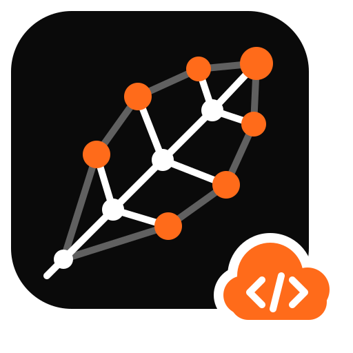

<p align="center">
  <picture>
    <source srcset="site/assets/logo.svg" type="image/svg+xml">
    
  </picture>
</p>

# oxilite

**An Oxigraph-compatible RDF database and SPARQL engine that uses SQLite as its storage engine. It runs anywhere SQLite runs, including Cloudflare D1.**

> **Status: milestones M1–M7 implemented** — M1 (storage core), M2 (full SPARQL 1.1 query compiled to SQL), M3 (atomic SPARQL Update, Cloudflare D1), the TypeScript packages, M4 (RDFS / OWL reasoning), M5 (SHACL / ShEx validation with rudof), M6 (BSBM benchmarks, planner tuning, full-text search) and M7 (openCypher over the same data). See [Roadmap](#roadmap).

---

## Why oxilite?

[Oxigraph](https://github.com/oxigraph/oxigraph) is an excellent Rust SPARQL database. It stores data in RocksDB, which needs a native storage engine and a local filesystem. That rules it out in exactly the places where many modern apps run:

- **Cloudflare D1 and similar edge databases.** You get a managed SQLite you can send SQL to, but you can't install extensions, load native libraries, or run RocksDB.
- **Hosts that ship their own SQLite.** Mobile apps, embedded devices, sandboxes, and platforms where the SQLite library is provided and extensions are disabled.
- **Apps that already use SQLite** and want a knowledge graph in the same file, backed up and replicated with the same tools.

oxilite gives you the Oxigraph experience (same data model, same SPARQL semantics, the same Rust API) using **only plain SQL on a standard SQLite**. It needs no extensions, no custom functions (they're optional, used when available), and no filesystem access beyond what the host SQLite provides.

### What makes it fast

Using SQLite as a triple store is not new. What oxilite adds is a design built around how SQLite executes queries, and around the costs of a *remote* SQLite:

| Technique | Why it matters |
|---|---|
| **Hash ids computed in Rust.** Each term becomes a tagged 64-bit integer (xxh3). | Writes never read anything back. SPARQL constants become integer literals at compile time, with no dictionary lookup. |
| **Inline values.** Canonical integers and booleans live inside the id, and integer ids sort by value. | `FILTER(?age > 30)` on inline integers needs no join, and ranges become id ranges. |
| **Covering `WITHOUT ROWID` indexes.** `quads` is clustered on `spog`, with `posg`, `ospg` and an optional `gspo`. | Every triple-pattern scan is index-only. Only 3–4 B-trees are written per quad, which matters because D1 bills every index entry. |
| **One SQL statement per query.** Joins, OPTIONAL, UNION, MINUS, aggregates, property paths (recursive CTEs) and ORDER BY/LIMIT all compile into a single `SELECT`. | On D1 each round-trip is milliseconds. A query costs 1–2 round-trips, not one per triple pattern or per row. |
| **Our own join ordering.** Per-predicate and per-class statistics drive a greedy planner, enforced with `CROSS JOIN`. | SQLite's planner can't tell `rdf:type` from a rare predicate in an N-way self-join. Choosing the order ourselves avoids scans that are 1000× too large. |
| **Typed side columns.** `num`, `nt` and `ts` columns (with partial indexes) sit on the term dictionary. | Numeric and date comparisons never re-parse lexical forms. |
| **Atomic = one batch.** Every write, including `DELETE/INSERT … WHERE`, compiles to self-reading SQL that fits in one transaction. | D1 has no interactive transactions; `batch()` is its only atomic unit. |

The full rationale is in [`lat.md/decisions.md`](lat.md/decisions.md) and [`lat.md/architecture.md`](lat.md/architecture.md).

### A "super combo" of existing Rust RDF crates

oxilite reuses the RDF ecosystem wherever it can:

| From | Reused for |
|---|---|
| **Oxigraph 0.5 family**: `oxrdf`, `oxrdfio`/`oxttl`, `spargebra`, `sparesults`, `oxsdatatypes`, `spareval` | Data model, all RDF parsers and serializers, the SPARQL parser and algebra, result formats, XSD datatypes, and a fallback evaluator for anything the SQL compiler can't express |
| **[rudof](https://github.com/rudof-project/rudof)**: `srdf`, `shacl_validation`, `shex_validation` | SHACL and ShEx validation over the store (same Oxigraph crate family, so no conversions) |
| **[reasonable](https://github.com/gtfierro/reasonable)** | OWL 2 RL materialization on native backends |
| **SQLite itself** | Storage, indexes, transactions, recursive CTEs, FTS5 |

---

## How it works

```
             SPARQL / RDF / Store API
                        │
        ┌───────────────▼────────────────┐
        │          oxilite-core           │   sans-IO: never touches a database
        │  spargebra → algebra → planner  │
        │  → SQL compiler → Request       │
        │  Response → decoder → results   │
        └───────────────┬────────────────┘
                        │  Request { statements, Read | Atomic }
     ┌──────────────┬───┴───────────┬────────────────┐
     ▼              ▼               ▼                ▼
 rusqlite       dylib (dlopen    D1 (Rust Worker,  wasm core +
 (bundled)      your libsqlite3)  worker::D1)      TS driver on env.DB
```

The core is **sans-IO**. Every operation yields SQL `Request`s and consumes `Response`s. That's why the same compiler serves native SQLite, a SQLite library loaded from a path at runtime, and D1 over the network. A backend is only "run these statements, atomically if asked".

### Storage schema

```sql
CREATE TABLE quads (s INTEGER NOT NULL, p INTEGER NOT NULL, o INTEGER NOT NULL,
                    g INTEGER NOT NULL DEFAULT 0,              -- 0 = default graph
                    PRIMARY KEY (s, p, o, g)) WITHOUT ROWID, STRICT;
CREATE INDEX quads_posg ON quads(p, o, s, g);
CREATE INDEX quads_ospg ON quads(o, s, p, g);
CREATE INDEX quads_gspo ON quads(g, s, p, o);                  -- optional

CREATE TABLE terms (id INTEGER PRIMARY KEY, lex TEXT NOT NULL, dt TEXT, lang TEXT,
                    dir INTEGER, num REAL, nt INTEGER, ts REAL) STRICT;
-- + triple_terms (RDF 1.2), graphs, stats_pred, stats_class, update_buffer, oxilite_meta
```

### What a query becomes

```sparql
SELECT ?name WHERE {
  ?p a ex:Person ; ex:age ?age ; ex:name ?name .
  FILTER(?age > 30)
}
```

compiles to a single statement, with the planner choosing `ex:age` first because statistics say it's more selective than `rdf:type`:

```sql
SELECT q2.o AS v2
FROM quads q1 CROSS JOIN quads q0 CROSS JOIN quads q2
WHERE q1.p = 2305843... AND +q1.g = 0
  AND (CASE (q1.o >> 59) WHEN 6 THEN (q1.o & 576460752303423487) - 288230376151711744
       WHEN 5 THEN (SELECT num FROM terms WHERE id = q1.o AND nt IS NOT NULL) END) > 30
  AND q0.s = q1.s AND q0.p = 2305843... AND q0.o = 2305843... AND +q0.g = 0
  AND q2.s = q1.s AND q2.p = 2305843... AND +q2.g = 0
```

The filter is applied right after the first scan, before any join. The unary `+` on graph conditions keeps SQLite from choosing the graph index for `g = 0` (which nearly every quad matches), so each alias uses the right covering permutation. Inline integers are compared arithmetically; only non-inline numbers (decimals, doubles) look up `terms`. `store.explain(query)` shows the SQL, the join order and the estimates.

### Planner benchmark (M1)

`cargo run --release -p oxilite --example planner_bench` loads 350 010 quads and runs three join-heavy queries with oxilite's planner and with SQLite's own (Apple Silicon laptop, in-process SQLite):

| query | oxilite planner | SQLite planner |
|---|---|---|
| star with a rare badge | 75 µs | 7.2 ms |
| friends of badged people | 96 µs | 87 µs |
| city + age range filter | 478 µs | 7.8 ms |

---

## Usage

```bash
cargo add oxilite                      # Rust (features: rusqlite (default), dylib, d1, reasonable, cypher)
cargo install oxilite-cli              # the `oxilite` command and SPARQL endpoint
npm install @oxilite/node              # Node.js (prebuilt for macOS arm64 in 0.2.0)
npm install @oxilite/d1                # Cloudflare D1 (WebAssembly)
```

Companion crates: `oxilite-validate` (SHACL/ShEx with rudof), `oxilite-reason` (OWL 2 RL with `reasonable`).

### Rust: drop-in for `oxigraph::store::Store`

```toml
[dependencies]
oxilite = "0.1"          # bundled SQLite via rusqlite
```

```rust
use oxilite::store::Store;             // was: use oxigraph::store::Store;
use oxilite::io::RdfFormat;
use oxilite::sparql::QueryResults;

let store = Store::open("data.sqlite")?;             // or Store::new() for in-memory
store.load_from_reader(RdfFormat::Turtle, TURTLE.as_bytes())?;

if let QueryResults::Solutions(solutions) =
    store.query("SELECT ?s WHERE { ?s a <http://schema.org/Person> }")?
{
    for s in solutions {
        println!("{}", s?.get("s").unwrap());
    }
}

store.update("INSERT DATA { <http://ex/a> <http://ex/p> 42 }")?;
store.optimize()?;          // refresh planner statistics (replaces RocksDB compact)
println!("{}", store.explain("SELECT * WHERE { ?s ?p ?o } LIMIT 1")?);
```

### Rust: your own SQLite library, loaded at runtime

```rust
use oxilite::dylib::DylibBackend;

// features = ["dylib"]
let store = oxilite::store::Store::open_with_library("/opt/vendor/lib/libsqlite3.so", "data.sqlite")?;
// or: Store::with_backend(DylibBackend::open(library, database)?)
```

Only the stable SQLite C API is bound (`open_v2`, `prepare_v2`, `step`, `column_*`, `finalize`, `errmsg`, `changes`, `exec`, and optionally `create_function_v2`), so any SQLite ≥ 3.37 works.

### Node.js (TypeScript)

```ts
import { Store, type Term } from "@oxilite/node";

const store = new Store("data.sqlite");               // new Store() in memory, new Store(quads) like Oxigraph
// or: new Store({ path: "data.sqlite", library: "/opt/vendor/lib/libsqlite3.so", graphIndex: false })
store.load(`@prefix ex: <http://ex/> . ex:a ex:knows ex:b .`, { format: "text/turtle" });
console.log(store.size);                               // a getter, as in Oxigraph

for (const row of store.query("SELECT ?x WHERE { ?x ?p ?o }") as Map<string, Term>[]) {
  console.log(row.get("x")?.value);
}
store.update("DELETE WHERE { ?s <http://ex/knows> ?o }");
```

The API mirrors Oxigraph's JS package (`query`, `update`, `load`, `dump`, `add`, `delete`, `has`, `match`, `size`), with RDF/JS terms, plus `explain`, `explainUpdate`, `bulkLoad`, `optimize` and `backup`. Oxigraph's own `store.test.ts` runs unchanged against it. Build the native addon from a checkout with `npm run build:native -w @oxilite/node`.

---

### Command line and SPARQL endpoint

```bash
cargo install --path crates/oxilite-cli                 # the `oxilite` binary
oxilite load  -l data.sqlite -f dump.nt                # bulk load, then refresh statistics
oxilite query -l data.sqlite -q 'SELECT * WHERE { ?s ?p ?o } LIMIT 5'
oxilite explain -l data.sqlite -q '…'                  # the SQL and the join order
oxilite serve -l data.sqlite -b 127.0.0.1:7879         # /query, /update, /store like `oxigraph serve`
oxilite serve -l data.sqlite --library /usr/lib/libsqlite3.dylib   # same file, system SQLite
```

### Full-text search

Create the store with the text index (`StoreOptions { text_index: true, .. }`, `--text-index`, or `{ textIndex: true }` in JavaScript) and match literals with FTS5:

```sparql
PREFIX oxl: <https://oxilite.dev/ns#>
SELECT ?product WHERE { ?product rdfs:label ?label FILTER(oxl:textMatch(?label, "graph data*")) }
```

With the index this is an FTS5 `MATCH` (on D1 too). Without it, native stores still answer through the fallback evaluator with the same word matching.

## Using oxilite with Cloudflare D1

D1 is a managed, serverless SQLite. You can't load extensions or native code, and every call is a network round-trip billed per row read and written. oxilite is designed around exactly these constraints.

### 1. Create the database and apply the schema

```bash
npx wrangler d1 create my-graph
npx wrangler d1 migrations create my-graph oxilite-schema
npx oxilite-d1 schema > migrations/0001_oxilite-schema.sql     # schema as a D1 migration
npx wrangler d1 migrations apply my-graph --remote
```

```toml
# wrangler.toml
[[d1_databases]]
binding = "DB"
database_name = "my-graph"
database_id = "<id>"
```

### 2a. TypeScript Worker

```ts
import { D1Store } from "@oxilite/d1";
import wasm from "@oxilite/d1/oxilite.wasm";            // the oxilite core, compiled to WebAssembly

export default {
  async fetch(req: Request, env: { DB: D1Database }): Promise<Response> {
    // `migrated: true` skips the (idempotent) schema DDL when the migration was applied.
    const store = await D1Store.open(env.DB, { wasm, migrated: true });
    const url = new URL(req.url);

    if (req.method === "POST" && url.pathname === "/update") {
      await store.update(await req.text());             // one atomic D1 batch
      return new Response(null, { status: 204 });
    }
    const q = url.searchParams.get("query") ?? "SELECT * WHERE { ?s ?p ?o } LIMIT 10";
    return new Response(await store.queryJson(q), {
      headers: { "content-type": "application/sparql-results+json" },
    });
  },
};
```

A complete endpoint with its `wrangler.toml`, migration and a Miniflare end-to-end test is in [`examples/d1-worker-ts`](examples/d1-worker-ts/).

`@oxilite/d1` runs the oxilite core as WebAssembly. The core compiles SPARQL to SQL, the driver sends it to `env.DB`, and the core decodes the rows. No Rust toolchain is needed in your Worker project.

### 2b. Rust Worker

```rust
use oxilite::{d1::D1Backend, AsyncStore};
use worker::*;

// oxilite = { version = "0.1", default-features = false, features = ["d1"] }
#[event(fetch)]
async fn fetch(req: Request, env: Env, _ctx: Context) -> Result<Response> {
    let store = AsyncStore::open_existing(D1Backend::new(env.d1("DB")?)).await.map_err(|e| e.to_string())?;
    let q = req.url()?.query_pairs().find(|(k, _)| k == "query").map(|(_, v)| v.into_owned())
        .unwrap_or_else(|| "ASK { ?s ?p ?o }".into());
    let out = store.query_output(q.as_str(), &Default::default()).await.map_err(|e| e.to_string())?;
    Response::ok(oxilite_core::json::output_to_sparql_json(&out).map_err(|e| e.to_string())?)
}
```

A complete endpoint (`/sparql`, `/update`, `/load`, `/explain`) with its `wrangler.toml` and migration is in [`examples/d1-worker`](examples/d1-worker/); build it with `worker-build --release`.

### 2c. Durable Objects

The same `@oxilite/d1` package runs on a Durable Object's embedded SQLite through a small adapter over `ctx.storage.sql` (atomic batches use `transactionSync`). That gives each agent or user a private graph. [`examples/do-agent-memory-ts`](examples/do-agent-memory-ts/) is a tested agent-memory Worker built this way; the [article](site/articles/agent-memory-durable-objects.html) walks through it.

### What oxilite does differently on D1

| D1 constraint | How oxilite handles it |
|---|---|
| No extensions or user-defined functions | Every SPARQL function has a pure-SQL form or a rewrite. The few that don't (general `REGEX`, `REPLACE`, hashes) return a clear "unsupported on this backend" error, and `explain()` flags them. |
| No interactive transactions; `batch()` is the only atomic unit | Every write is one batch. `DELETE/INSERT … WHERE` stages its WHERE results in `update_buffer` inside the same batch, so SPARQL's evaluate-then-apply semantics hold. |
| Statement size limit (100 KB), 100 bound parameters, 50 statements per batch | Constants are inlined as escaped SQL literals and never bound. Generated SQL is kept under 90 KB (larger queries report `unsupported`), and large inserts are split into statements and batches under the limits. |
| Parser limits: at most 5 terms in a compound SELECT, GLOB patterns up to 50 bytes | Large UNIONs are nested into groups of at most five, and lexical-form checks split their GLOB patterns into short pieces. |
| JavaScript numbers lose precision above 2^53 | Ids (60-bit) are selected as TEXT and parsed in the core. |
| Billed per row read and written | Few indexes, read-free writes, no per-write statistics updates, one statement per query, and deduplicated term resolution. |
| Per-invocation query limits | Queries use 1–2 requests; bulk loads are chunked (and documented as non-atomic across chunks, like Oxigraph's `BulkLoader`). |

Check [Cloudflare's current D1 limits](https://developers.cloudflare.com/d1/platform/limits/); oxilite's `Capabilities::d1()` defaults are kept below them and can be tuned.

**Tips for D1:**
- Run `store.optimize()` after large imports. It refreshes planner statistics in one batch that reads the whole table, so don't call it on every request.
- Create the store without the graph index (`graph_index: false`) if you only use the default graph. That saves one index write per quad.
- Use `explain()` in development to confirm your queries compile fully to SQL.

---

## Compatibility with Oxigraph

"Behaves like Oxigraph" is tested, not assumed. The [`oxigraph-compat-harness`](openspec/changes/oxigraph-compat-harness/) runs:
- **Oxigraph's own W3C manifest runner**, ported from `oxigraph/testsuite`, over `rdf-tests` and Oxigraph's `oxigraph-tests`. Each test gets three verdicts: oxilite vs. expected, Oxigraph vs. expected, and oxilite vs. Oxigraph.
- **Oxigraph's store API tests** (`lib/oxigraph/tests/store.rs`) against `oxilite::blocking::Store`, changing only the import.
- **Oxigraph's JS tests** (`js/test/store.test.ts`) against `@oxilite/node`.
- **A differential corpus**: seeded datasets and query families run on both engines, with statistics on and off and with our planner and SQLite's. The results must match.
- **An allow-list** of justified divergences, each linked to a decision, and a generated `COMPATIBILITY.md`.

Intentional differences:
- `backup` is `VACUUM INTO` and `compact` is `optimize()`; RocksDB-specific methods are absent.
- On D1, queries that need the Rust fallback evaluator return an "unsupported" error instead of running.
- Decimal values are compared as IEEE doubles (the lexical form is always preserved exactly).

---

## Performance

Measured with the [Berlin SPARQL Benchmark](http://wbsg.informatik.uni-mannheim.de/bizer/berlinsparqlbenchmark/) and its official tools against Oxigraph 0.5.11 (RocksDB), on one laptop. Run `bench/bsbm.sh [products] [parallelism] [runs]` to reproduce, then `cargo run -p oxilite-bench --bin bsbm-report` to regenerate this table. QMpH is query mixes per hour, so higher is better.

<!-- bsbm-results:begin -->

**1000 products (374911 triples)**

| engine | load (s) | size (MB) | explore QMpH | business intelligence QMpH |
|---|---|---|---|---|
| oxigraph | 0.30 | 43.9 | 489260 | 520 |
| oxilite | 4.80 | 85.4 | 335015 | 899 |
| oxilite-d1 | 16.55 | – | 7982 | 841 |
| oxilite-dylib | 2.85 | 85.6 | 348838 | 1233 |

| explore query (avg ms) | oxigraph | oxilite | oxilite-d1 | oxilite-dylib |
|---|---|---|---|---|
| Q1 | 0.43 | 0.82 | 56.45 | 0.82 |
| Q2 | 0.96 | 1.82 | 59.13 | 2.09 |
| Q3 | 0.43 | 0.89 | 59.00 | 0.81 |
| Q4 | 0.53 | 0.94 | 52.94 | 0.85 |
| Q5 | 4.92 | 1.64 | 64.81 | 1.60 |
| Q7 | 1.07 | 1.92 | 65.76 | 1.85 |
| Q8 | 0.78 | 1.62 | 92.17 | 1.51 |
| Q9 | 0.21 | 0.91 | 103.55 | 0.82 |
| Q10 | 0.73 | 1.34 | 80.12 | 1.26 |
| Q11 | 0.31 | 1.01 | 61.89 | 0.94 |
| Q12 | 0.34 | 0.88 | 57.24 | 0.94 |

<!-- bsbm-results:end -->

Every query returned the same results on all engines; explore Q9 (a DESCRIBE) differs only in RDF/XML byte size, because oxilite writes the same triples in a different order. `oxilite-d1` runs on a local D1 (Miniflare) behind an HTTP sidecar, so each query pays about 55 ms of round trips; it measures the D1 code path, not Cloudflare's latency. oxilite trades load speed and file size (three covering indexes over integer ids in one SQLite file) for running anywhere SQLite runs; on the aggregate-heavy business-intelligence mix it is faster than Oxigraph.

**D1 write cost.** Rows written per inserted triple (D1's billing unit, index entries included), measured on a local D1 by `cargo run -p oxilite-bench --bin write-cost`:

| schema | rows written per triple |
|---|---|
| graph index (default) | 4.81 |
| without the graph index (`graphIndex: false`) | 3.81 |
| graph index + text index | 5.01 |

## Reasoning and validation

- **Reasoning (M4).** Per-query `Rdfs` / `OwlQl` entailment by rewriting against a small materialized TBox closure. Queries stay single statements and there are no extra writes. OWL 2 RL materialization is available on request via `materialize()`, using SQL fixpoint rules everywhere (D1 included) and, natively, `reasonable` (feature `reasonable`), with identical results.

```rust
use oxilite::sparql::{QueryOptions, Reasoning};

// ex:Dog rdfs:subClassOf ex:Animal . ex:rex a ex:Dog .
let opts = QueryOptions { reasoning: Reasoning::Rdfs, ..Default::default() };
let out = store.query_output("SELECT ?x WHERE { ?x a <http://ex/Animal> }", &opts)?;   // ex:rex

store.materialize()?;                                   // OWL 2 RL closure into quads_inf
let opts = QueryOptions { include_inferred: true, ..Default::default() };
```

```ts
store.query("SELECT ?x WHERE { ?x a ex:Animal }", { reasoning: "rdfs" });    // or "owl-ql"
await d1store.materialize();                                                  // SQL rules, one D1 batch per round
d1store.query(q, { include_inferred: true });
```

The schema closure is refreshed by `optimize()` and automatically, in the same transaction, by any write that touches `rdfs:subClassOf`, `rdfs:subPropertyOf`, `rdfs:domain`, `rdfs:range`, `owl:equivalentClass`, `owl:equivalentProperty`, `owl:inverseOf` or symmetric/transitive property declarations. Materialized inferences are not maintained: re-run `materialize()` after changing data. D1 databases created by an older migration need the new `tbox_closure` and `quads_inf` tables (re-run `npx oxilite-d1 schema`; every statement is `IF NOT EXISTS`).
- **Validation (M5).** SHACL and ShEx through rudof, unchanged, in the `oxilite-validate` crate. Native stores implement rudof's RDF traits directly, so rudof's SPARQL-mode validation runs through the oxilite compiler; on the W3C SHACL core suite and the shexTest suite the results are identical to rudof's in-memory graph. rudof does not build its validators for wasm32, so D1 is validated from native code (a CLI, a server, CI) over the D1 HTTP API: the subgraph the shapes need is prefetched in a few batched requests, with a size limit that fails loudly.

```rust
use oxilite_validate::{validate_shacl, validate_shex, ShaclValidationMode};

let report = validate_shacl(&store, shapes_ttl, &ShaclValidationMode::Native)?;
if !report.conforms() { println!("{report}"); }
let results = validate_shex(&store, shexc, "http://example.com/", "<http://example.com/alice>@<http://example.com/Person>")?;

// D1 (any AsyncBackend): bounded prefetch, then validation in memory
let report = oxilite_validate::prefetch::validate_shacl_async(&d1_store, shapes_ttl, &ShaclValidationMode::Native, &Default::default()).await?;
```

## Cypher and property graphs

The same dataset is also a property graph you can query with **openCypher** (M7, feature `cypher`, crate `oxilite-cypher`). Nodes are IRIs, labels are `rdf:type`, properties are literal triples, and relationships are triples; a relationship's properties live on an RDF 1.2 reifier (`?r rdf:reifies <<( ?a :KNOWS ?b )>>`), created only when needed. Data written with Cypher is plain RDF for SPARQL, and RDF loaded from Turtle is a graph for Cypher.

```rust
use oxilite::cypher::{CypherOptions, Params, Vocabulary};

let opts = CypherOptions { vocabulary: Vocabulary::new("http://example.com/"), ..Default::default() };
store.cypher_with("CREATE (:Person {name: 'Ada'})-[:KNOWS {since: 2020}]->(:Person {name: 'Alan'})", &Params::new(), &opts)?;
let r = store.cypher_with("MATCH (a:Person)-[k:KNOWS]->(b) RETURN b.name, k.since", &Params::new(), &opts)?;
// SPARQL sees the same data: ASK { ?a ex:KNOWS ?b . ?r rdf:reifies <<( ?a ex:KNOWS ?b )>> ; ex:since 2020 }
```

```ts
const r = store.cypher("MATCH p = shortestPath((a:Station {id: $from})-[:LINE*]-(b:Station {id: $to})) RETURN length(p) AS hops", { from: 1, to: 9 });
await d1store.cypher("UNWIND $rows AS row MERGE (p:Person {id: row.id}) SET p.name = row.name", { rows });
```

- **How it runs.** Reading clauses become one SPARQL query, compiled to SQL by the same compiler and planner (reasoning and the fallback included). What SQL cannot express — writes, lists, maps, `collect()`, temporal arithmetic — runs in Rust over the rows. A writing statement reads once and applies its changes as **one atomic request** (one D1 batch). `shortestPath` is a breadth-first search, one SQL request per level, so it works on D1. `explain_cypher()` shows the SPARQL and the SQL.
- **OWL and SHACL aware.** With `reasoning: "rdfs"` / `"owl-ql"`, labels match subclasses and relationship types their subproperties and inverses. SHACL shapes stored in the dataset are the graph's schema: writes that break `sh:datatype`, cardinality, `sh:in` or `sh:pattern` are rejected before anything is written, `sh:minCount 1` properties join without `OPTIONAL`, `sh:datatype` types comparisons for the compiler, and `CALL db.labels()` / `db.schema.nodeTypeProperties()` read shapes and data.
- **Coverage.** 3728 of the 3880 [openCypher TCK](https://github.com/opencypher/openCypher/tree/main/tck) scenarios pass (read-only 96.3%, temporal functions 100%), on the bundled SQLite; the failures (user-defined procedures, reading after a write in one statement, errors on deleted entities…) are listed in [`crates/oxilite-cypher/tck-allowlist.txt`](crates/oxilite-cypher/tck-allowlist.txt).

---

## Roadmap

| Milestone | Scope | Done when | Status |
|---|---|---|---|
| Compat harness | Oxigraph test ports + differential corpus | runs in CI for every milestone | ✅ done: W3C suites, Rust and JS store API ports, differential corpus, D1 variant |
| **M1** Storage core | encoding, schema, backends, load/dump, BGP+FILTER → SQL, planner | W3C syntax suites + ported store API tests pass | ✅ done |
| **M2** Full SPARQL 1.1 query | OPTIONAL, UNION, MINUS, aggregates, paths, subqueries, `explain()` | ≥ 95% W3C query suite | ✅ done: 100% pass, 95% of evaluations fully in SQL ([COMPATIBILITY.md](COMPATIBILITY.md)) |
| **M3** Update + D1 | atomic SPARQL UPDATE, `oxilite-d1`, wasm core | W3C update suite on rusqlite and local D1 | ✅ done: W3C update suites pass on every backend, D1 included |
| TS bindings | `@oxilite/node`, `@oxilite/d1` | test suites + Oxigraph JS tests | ✅ done: Oxigraph `store.test.ts` 32/33 (1 allow-listed), both example Workers tested on Miniflare |
| **M4** Reasoning | TBox closure, rewriting, OWL 2 RL | entailment tests; agreement with `reasonable` | ✅ done: RDFS/OWL QL rewriting, SQL OWL 2 RL rules on every backend, identical to `reasonable` |
| **M5** Validation | rudof SHACL/ShEx | rudof suites over oxilite | ✅ done: W3C SHACL core and shexTest results identical to rudof in memory; bounded D1 prefetch |
| **M6** Performance | BSBM vs Oxigraph, tuning, FTS5 | published comparison | ✅ done: BSBM results in [Performance](#performance), D1 write-cost report, FTS5 text search |
| **M7** Cypher | openCypher over the RDF store, OWL- and SHACL-aware | ≥ 80% of read-only TCK scenarios | ✅ done: 96.1% of the TCK (read-only 96.3%), on bundled SQLite, system SQLite and D1 |

---

## Project documentation

- [`site/`](site/): the project website (static, deployed to GitHub Pages by `.github/workflows/pages.yml`). The logo is [`site/assets/logo.svg`](site/assets/logo.svg), with a PNG at [`site/assets/logo.png`](site/assets/logo.png).
- [`lat.md/`](lat.md/): the architecture knowledge graph (architecture, decisions, milestones, tests, test plan), checked by `lat check`.
- [`openspec/changes/`](openspec/changes/): one change per milestone, each with a proposal, requirement specs with scenarios, a design, and a task list (`openspec validate --all --strict`).

## License

Dual-licensed under MIT or Apache-2.0, like Oxigraph.
